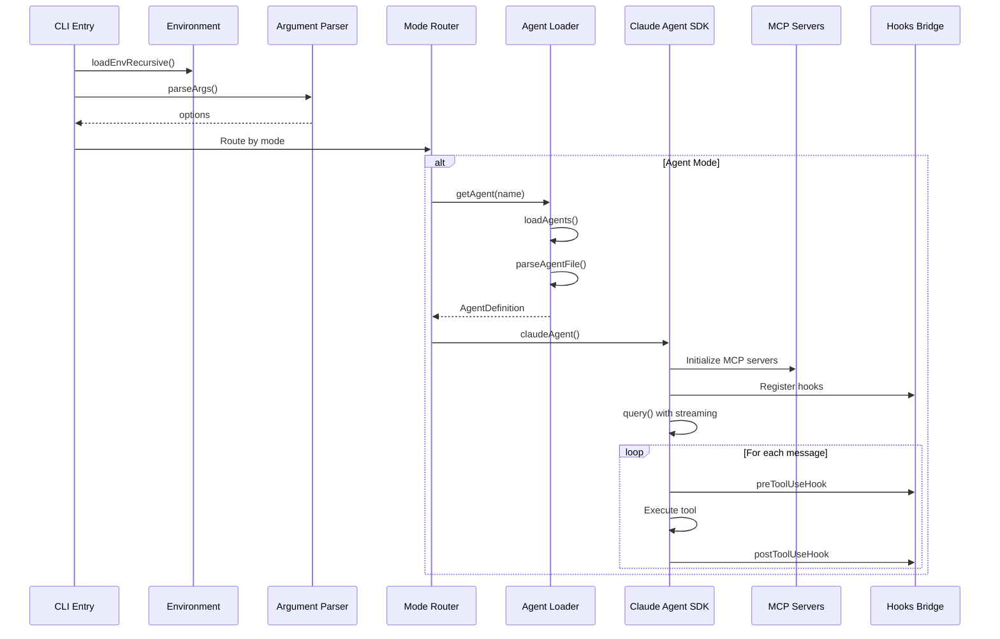

# Agentic Flow - Core Architecture Deep Dive

**Research Date:** 2026-01-22
**Version Analyzed:** 2.0.1-alpha
**Location:** `/Users/alphab/Dev/LLM/DEV/agentic-flow`

---

## Executive Summary

Agentic Flow is a comprehensive AI agent orchestration platform built on the Claude Agent SDK. It provides:
- 66+ specialized agents defined as markdown templates
- 213+ MCP tools for agent coordination
- ReasoningBank closed-loop memory system
- Multi-provider LLM routing with intelligent fallback
- Swarm coordination with QUIC transport
- Neural network integrations (GNN, attention mechanisms)

This document analyzes the core architecture patterns and identifies components that could be adopted for Nancy.

---

## Architecture Overview

```
agentic-flow/
├── agentic-flow/           # Main module (npm package source)
│   └── src/
│       ├── agents/         # Agent implementations
│       ├── cli/            # CLI commands
│       ├── core/           # Wrappers for external packages
│       ├── mcp/            # MCP server implementations
│       ├── reasoningbank/  # Memory/learning system
│       ├── router/         # Request routing
│       ├── sdk/            # Claude Agent SDK integration
│       ├── swarm/          # Multi-agent coordination
│       └── utils/          # Shared utilities
├── packages/               # Sub-packages
│   ├── agent-booster/      # Fast local code editing
│   ├── agentdb/            # Vector database
│   ├── agentdb-onnx/       # ONNX model support
│   ├── agentic-jujutsu/    # VCS integration
│   └── agentic-llm/        # LLM utilities
└── src/                    # Additional app (medical domain example)
```

### High-Level Flow

```mermaid
graph TB
    CLI[CLI Entry Point<br>cli-proxy.ts] --> Parser[parseArgs]
    Parser --> Router{Mode Router}

    Router --> Agent[Agent Mode]
    Router --> MCP[MCP Mode]
    Router --> Swarm[Swarm Mode]
    Router --> Config[Config Mode]

    Agent --> Loader[agentLoader.ts<br>Load .claude/agents/*.md]
    Loader --> ClaudeAgent[claudeAgent.ts]
    ClaudeAgent --> Provider[Provider Manager<br>Anthropic/Gemini/OpenRouter]
    ClaudeAgent --> MCPServers[MCP Servers<br>In-SDK + External]

    Provider --> SDK[Claude Agent SDK<br>query()]
    MCPServers --> SDK

    SDK --> Hooks[SDK Hooks Bridge<br>Intelligence Layer]
    Hooks --> Memory[ReasoningBank<br>Pattern Storage]

    subgraph Swarm Coordination
        SwarmInit[initSwarm] --> Transport[TransportRouter<br>QUIC/HTTP2]
        Transport --> Coordinator[QuicCoordinator]
        Coordinator --> Agents[Registered Agents]
    end
```

---

## Module Analysis

### 1. Entry Points

**Primary Entry: `agentic-flow/src/cli-proxy.ts`**

The CLI proxy is the main orchestrator that:
1. Loads environment variables recursively up directory tree
2. Parses CLI arguments into options
3. Routes to appropriate mode handler
4. Manages proxy servers for non-Anthropic providers

**Mode Handlers:**
- `list` - Lists available agents
- `config` - Configuration wizard
- `agent-manager` - Agent CRUD operations
- `mcp-manager` - MCP server management
- `proxy` - Standalone proxy server
- `quic` - QUIC transport proxy
- `claude-code` - Claude Code wrapper
- `mcp` - Standalone MCP server
- `reasoningbank` - Memory system commands
- `federation` - Distributed federation

**Secondary Entry: `agentic-flow/src/index.ts`**

Simpler entry point for library usage:
- Imports agent functions directly
- Provides `runParallelMode()` for fan-out execution
- Provides `runAgentMode()` for single agent execution
- Re-exports ReasoningBank for npm consumers

### 2. Agent Loading System

**File: `agentic-flow/src/utils/agentLoader.ts`**

Clever pattern for loading agents from markdown files:

```typescript
interface AgentDefinition {
  name: string;
  description: string;
  systemPrompt: string;
  color?: string;
  tools?: string[];
  filePath: string;
}
```

**Key Features:**
- Parses frontmatter YAML from `.md` files
- Supports local override of package agents
- Recursive directory scanning
- Deduplication by relative path

**Agent File Format:**
```markdown
---
name: coder
description: "Implements code with best practices"
color: blue
tools: Read,Write,Edit,Bash
---

You are a coding expert...
```

**Worth Lifting:** The markdown-based agent definition pattern is elegant. Nancy could adopt this for skill definitions.

### 3. Claude Agent Integration

**File: `agentic-flow/src/agents/claudeAgent.ts`**

Central integration point with Claude Agent SDK:

```typescript
export async function claudeAgent(
  agent: AgentDefinition,
  input: string,
  onStream?: (chunk: string) => void,
  modelOverride?: string
)
```

**Key Patterns:**

1. **Multi-Provider Routing:**
   ```typescript
   function getCurrentProvider(): string {
     if (process.env.PROVIDER === 'gemini') return 'gemini';
     if (process.env.PROVIDER === 'openrouter') return 'openrouter';
     return 'anthropic';
   }
   ```

2. **Dynamic MCP Server Loading:**
   - In-SDK MCP server (`claudeFlowSdkServer`)
   - External MCP servers via stdio
   - User config from `~/.agentic-flow/mcp-config.json`

3. **Stream Event Processing:**
   - Handles `assistant` messages
   - Processes `content_block_start` for tool use
   - Tracks tool call counts and timing

### 4. Provider Manager

**File: `agentic-flow/src/core/provider-manager.ts`**

Sophisticated provider failover system:

```typescript
interface ProviderConfig {
  name: ProviderType;
  priority: number;
  maxRetries: number;
  timeout: number;
  costPerToken: number;
  enabled: boolean;
}

interface FallbackStrategy {
  type: 'priority' | 'cost-optimized' | 'performance-optimized' | 'round-robin';
  maxFailures: number;
  recoveryTime: number;
  retryBackoff: 'linear' | 'exponential';
}
```

**Clever Patterns:**

1. **Circuit Breaker:**
   - Tracks consecutive failures
   - Opens circuit after threshold
   - Auto-recovery after timeout

2. **Strategy-Based Selection:**
   - Priority-based (simple fallback)
   - Cost-optimized (cheapest for token estimate)
   - Performance-optimized (latency + success rate)
   - Round-robin (load distribution)

3. **Task Complexity Heuristics:**
   ```typescript
   if (taskComplexity === 'complex' && this.providers.has('anthropic')) {
     selectedProvider = 'anthropic'; // Prefer Claude for complex tasks
   } else if (taskComplexity === 'simple' && this.providers.has('gemini')) {
     selectedProvider = 'gemini'; // Faster, cheaper
   }
   ```

**Worth Lifting:** The entire ProviderManager class is well-designed. Nancy could use this pattern for model routing.

### 5. SDK Hooks Bridge

**File: `agentic-flow/src/sdk/hooks-bridge.ts`**

Bridges agentic-flow intelligence with Claude Agent SDK hooks:

```typescript
type HookEvent =
  | 'PreToolUse'
  | 'PostToolUse'
  | 'PostToolUseFailure'
  | 'SessionStart'
  | 'SessionEnd'
  | 'SubagentStart'
  | 'SubagentStop';
```

**Key Patterns:**

1. **Trajectory Tracking:**
   - Starts trajectory on file operations
   - Tracks success/failure outcomes
   - Auto-cleanup with TTL (5 minutes)

2. **Pattern Storage:**
   - Records successful patterns
   - Feeds into ReasoningBank learning

3. **Lazy Loading:**
   ```typescript
   async function getIntelligenceBridge() {
     if (!intelligenceBridge) {
       intelligenceBridge = await import("../mcp/fastmcp/tools/hooks/intelligence-bridge.js");
     }
     return intelligenceBridge;
   }
   ```

### 6. ReasoningBank Memory System

**File: `agentic-flow/src/reasoningbank/index.ts`**

Closed-loop memory system based on Google DeepMind research:

```typescript
export async function runTask(options: {
  taskId: string;
  agentId: string;
  query: string;
  domain?: string;
  executeFn: (memories: any[]) => Promise<any>;
}): Promise<{
  verdict: any;
  usedMemories: any[];
  newMemories: string[];
  consolidated: boolean;
}>
```

**Core Components:**
1. **Retrieve** - Memory retrieval with embeddings
2. **Judge** - Trajectory evaluation
3. **Distill** - Extract new memories from outcomes
4. **Consolidate** - Periodic memory compression

**Integration with AgentDB:**
- ReflexionMemory for episodic memory
- SkillLibrary for reusable skills
- CausalMemoryGraph for causal reasoning
- EmbeddingService for vector search

**Worth Lifting:** The retrieve-judge-distill-consolidate cycle is a powerful pattern for agent learning.

### 7. Swarm Coordination

**File: `agentic-flow/src/swarm/index.ts`**

Multi-agent swarm with QUIC transport:

```typescript
interface SwarmInitOptions {
  swarmId: string;
  topology: 'mesh' | 'hierarchical' | 'ring' | 'star';
  transport?: 'quic' | 'http2' | 'auto';
  maxAgents?: number;
}
```

**Key Features:**
- QUIC transport with HTTP/2 fallback
- Multiple topology options
- Agent registration/unregistration
- Automatic protocol negotiation

### 8. MCP Server Integration

**In-SDK Server: `agentic-flow/src/mcp/claudeFlowSdkServer.ts`**

Uses `createSdkMcpServer` from Claude Agent SDK:

```typescript
export const claudeFlowSdkServer = createSdkMcpServer({
  name: 'claude-flow-sdk',
  version: '1.0.0',
  tools: [
    tool('memory_store', ...),
    tool('memory_retrieve', ...),
    tool('swarm_init', ...),
    tool('agent_spawn', ...),
    tool('agent_booster_edit_file', ...),
  ]
});
```

**Clever Pattern:** The in-SDK MCP server runs in-process, avoiding subprocess overhead.

---

## Core Abstractions

### AgentDefinition Interface
```typescript
interface AgentDefinition {
  name: string;
  description: string;
  systemPrompt: string;
  color?: string;
  tools?: string[];
  filePath: string;
}
```

### Provider Types
```typescript
type ProviderType = 'anthropic' | 'gemini' | 'openrouter' | 'onnx';
```

### Hook Events
```typescript
type HookEvent =
  | 'PreToolUse'
  | 'PostToolUse'
  | 'PostToolUseFailure'
  | 'SessionStart'
  | 'SessionEnd'
  | 'SubagentStart'
  | 'SubagentStop';
```

---

## Bootstrap / Initialization Flow



---

## Clever Patterns Worth Learning

### 1. Recursive Environment Loading
```typescript
function loadEnvRecursive(startPath = process.cwd()): boolean {
  let currentPath = startPath;
  while (currentPath !== root) {
    const envPath = resolve(currentPath, '.env');
    if (existsSync(envPath)) {
      dotenv.config({ path: envPath });
      return true;
    }
    currentPath = resolve(currentPath, '..');
  }
  return false;
}
```

### 2. Agent Override Pattern
Local agents in `.claude/agents/` override package agents with same relative path:
```typescript
const existingAgent = agentsByRelativePath.get(relativePath);
if (existingAgent) {
  agents.delete(existingAgent.name);
}
agents.set(agent.name, agent);
```

### 3. Trajectory TTL Auto-Cleanup
```typescript
const TRAJECTORY_TTL_MS = 5 * 60 * 1000;
setInterval(cleanupStaleTrajectories, 2 * 60 * 1000).unref();
```

### 4. Circuit Breaker Pattern
```typescript
if (health.consecutiveFailures >= this.strategy.maxFailures) {
  health.circuitBreakerOpen = true;
  health.isHealthy = false;
}
```

### 5. In-SDK MCP Server
Avoids subprocess overhead by running MCP in-process:
```typescript
const claudeFlowSdkServer = createSdkMcpServer({
  name: 'claude-flow-sdk',
  tools: [...]
});
```

---

## What Could Be Lifted for Nancy

### High Priority

1. **Markdown-Based Agent/Skill Definitions**
   - Nancy already has skill.md files
   - Could adopt the frontmatter parsing pattern
   - Enables rich metadata without separate config files

2. **Provider Manager with Circuit Breaker**
   - Nancy currently doesn't have multi-model fallback
   - Could implement for model redundancy
   - Task complexity routing is valuable

3. **Hooks Bridge Pattern**
   - Nancy has hooks but not intelligence layer integration
   - Could track patterns from successful operations
   - Feed into learning/improvement cycles

4. **Recursive Environment Loading**
   - Simple but useful for monorepo setups
   - Nancy could adopt for .env discovery

### Medium Priority

5. **Agent Override Pattern**
   - Package defaults + local overrides
   - Good for skill customization

6. **TTL-Based Cleanup**
   - For session state, trajectory tracking
   - Prevents memory leaks

### Lower Priority (Complex to Integrate)

7. **ReasoningBank Memory System**
   - Powerful but complex
   - Requires AgentDB dependency
   - Could be a future enhancement

8. **QUIC Transport**
   - Only relevant for distributed/swarm use cases
   - Nancy is currently single-agent focused

---

## Nancy Integration Recommendations

### Immediate Opportunities

1. **Enhance Skill Loading:**
   ```bash
   # Current Nancy pattern
   skills/
   ├── my-skill/
   │   └── skill.md

   # Could add frontmatter like agentic-flow
   ---
   name: my-skill
   description: "Does something useful"
   tools: Read,Write,Edit
   priority: high
   ---
   ```

2. **Add Provider Fallback:**
   ```typescript
   // In nancy's driver layer
   const providerManager = new ProviderManager([
     { name: 'anthropic', priority: 1, ... },
     { name: 'openrouter', priority: 2, ... }
   ], {
     type: 'priority',
     maxFailures: 3,
     recoveryTime: 60000
   });
   ```

3. **Implement Pattern Tracking:**
   ```typescript
   // In nancy's hooks
   export async function postToolUseHook(tool, result) {
     if (result.success) {
       await storePattern({
         tool,
         context: extractContext(),
         timestamp: Date.now()
       });
     }
   }
   ```

### Future Considerations

1. **In-SDK MCP Server:**
   - Nancy currently uses MCP for external tools
   - Could add in-process tools for faster operation

2. **Learning Cycle:**
   - Adopt retrieve-judge-distill-consolidate pattern
   - Start with simple pattern storage, evolve over time

---

## Strengths

1. **Comprehensive Feature Set** - Covers agents, memory, swarm, providers
2. **Clean SDK Integration** - Good use of Claude Agent SDK
3. **Extensible Architecture** - Easy to add new agents, providers
4. **Multi-Provider Support** - Not locked to Anthropic
5. **Memory/Learning** - ReasoningBank is sophisticated
6. **Good TypeScript** - Strong typing throughout

## Weaknesses

1. **Complexity** - Many moving parts, hard to understand initially
2. **Dependencies** - Heavy reliance on `@ruvector/*` packages (alpha quality)
3. **Documentation** - Could use more architecture docs
4. **Testing** - Test coverage varies across modules
5. **Monorepo Sprawl** - Multiple packages with overlapping concerns

---

## Conclusion

Agentic Flow represents a mature, feature-rich approach to AI agent orchestration. Its core patterns - particularly the provider manager, hooks bridge, and markdown-based agent definitions - are well-designed and could benefit Nancy.

The ReasoningBank memory system is the most sophisticated component and represents a significant investment in agent learning capabilities. While complex to adopt wholesale, its patterns (retrieve-judge-distill-consolidate) could inform Nancy's future evolution.

**Recommended Adoption Path:**
1. Start with markdown frontmatter parsing for skills
2. Add provider fallback with circuit breaker
3. Implement basic pattern tracking in hooks
4. Evaluate ReasoningBank-style learning for v2

---

*Research conducted for Nancy project integration planning.*
